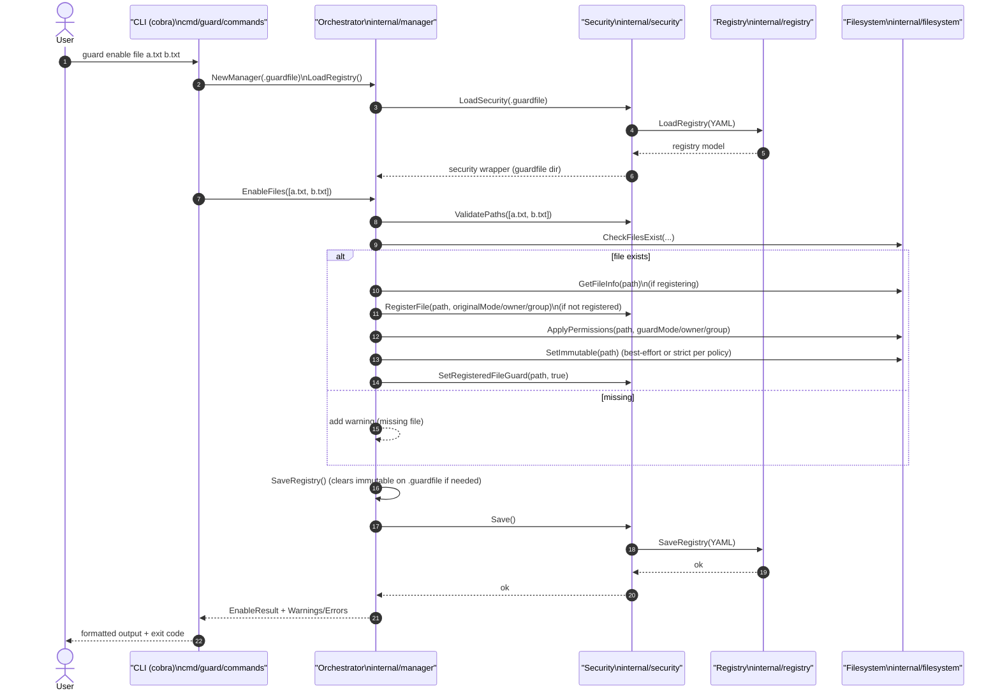
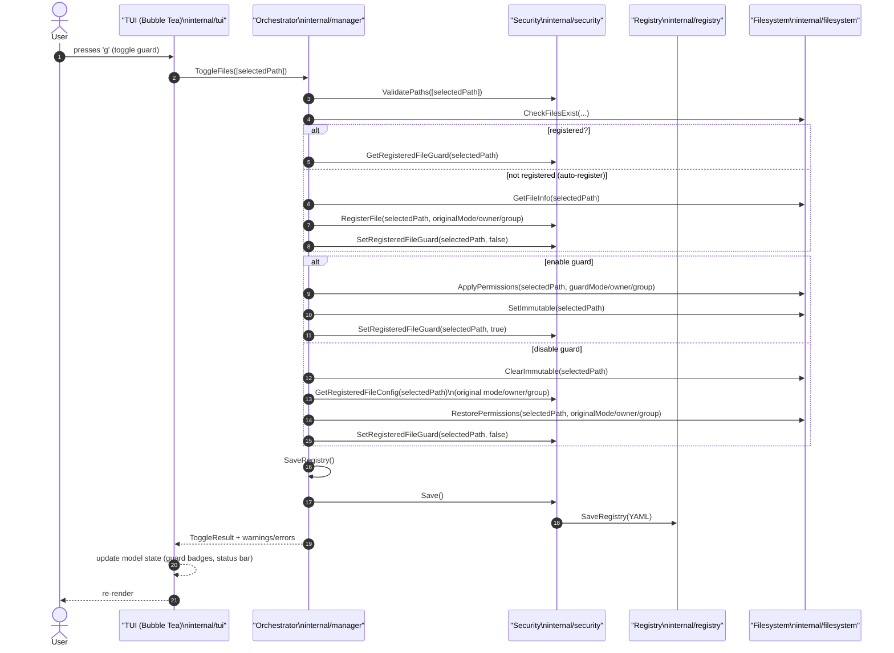

# Architecture

Date: 2026-02-05

This document is the **reference architecture** for Guard. It describes the target layered design, the responsibilities of each layer, and the rules that keep the codebase debuggable and extensible over time.

The layering violations identified during initial development have been resolved through refactoring.

---

## Envisioned layered architecture (ASCII diagram)

```text
  +------------------------------+      +------------------------------+
  | CLI parsing & dispatch       |      | Text UI (TUI)                |
  | cmd/guard + cmd/guard/commands|      | internal/tui                 |
  +---------------+--------------+      +---------------+--------------+
                  \                                /
                   \                              /
                    v                            v
            +----------------------------------------------+
            | Orchestration / Use-cases                     |
            | internal/manager                               |
            | - sequencing + idempotency                     |
            | - aggregates warnings/errors                   |
            | - returns structured results for UI            |
            +-------------------+--------------------------+
                                |
                +---------------+----------------+
                |                                |
                v                                v
     +--------------------------+     +-------------------------------+
     | Filesystem operations    |     | Security + persistence         |
     | internal/filesystem      |     | internal/security → registry   |
     | - chmod/chown/chgrp      |     | - path validation + tamper     |
     | - immutable flags        |     | - YAML load/save               |
     +--------------------------+     +-------------------------------+
```

---

## Layers (responsibilities and constraints)

### 1) CLI parsing & dispatch (`cmd/guard/*`)

**Owns**
- Parsing user input into arguments and flags (Cobra commands).
- Mapping input to orchestration calls (use-cases).
- Formatting output for STDOUT/STDERR and selecting exit codes.

**Must not**
- Call `internal/security`, `internal/registry`, or `internal/filesystem` directly.
- Reach into orchestration internals (e.g., no “raw registry access” like `mgr.GetRegistry()`).

**Implementation guidance**
- Treat manager calls as black-box operations:
  - call use-case
  - render returned result + warnings/errors
  - exit appropriately

### 2) Text UI (TUI) (`internal/tui/*`)

**Owns**
- Terminal UI state and rendering (Bubble Tea Model/Update/View).
- Keyboard bindings, layouts, styling, and user interaction patterns.
- Translating user interactions into orchestration calls.

**Must not**
- Read directories or stat files directly (no `os.*`, no `internal/filesystem`).
- Read or write the registry directly (no `internal/security` / `internal/registry`, no `reg.Save()`).

**Implementation guidance**
- The TUI is a *client* of orchestration:
  - All reads that affect display (guard state, collection membership, directory listing) should come from manager-provided queries.
  - All writes (toggle/enable/disable/create/update) should be manager use-cases that also own persistence.

### 3) Orchestration / use-cases (`internal/manager/*`)

**Owns**
- Sequencing and idempotency of multi-step operations.
- The *application-level* meaning of commands (e.g., “toggle collection” must sync file states).
- Aggregating warnings and errors and returning structured results.
- Making persistence safe and consistent (especially `.guardfile` immutability handling).

**Allowed dependencies**
- `internal/filesystem` for OS-level actions.
- `internal/security` for registry access with path validation and tamper detection.

**Must not**
- Print to STDOUT/STDERR (presentation is owned by CLI/TUI).
- Expose raw persistence objects (avoid public methods returning `*security.Security` or `*registry.Registry`).

**Owned invariants (must hold across features)**
- Guard state in the registry and permissions on disk should not silently diverge.
- Writes to `.guardfile` should go through a manager path that:
  1) clears immutable flags (if applicable),
  2) writes safely,
  3) surfaces errors/warnings to the caller.
- All user-supplied paths must be validated through `internal/security` before mutation.

### 4) Filesystem operations (`internal/filesystem/*`)

**Owns**
- Low-level OS operations and platform-specific details:
  - chmod/chown/chgrp
  - immutable flag checks/set/clear (macOS/Linux)
  - directory listing / file enumeration helpers

**Must not**
- Print warnings or errors (return errors; orchestration decides messaging).
- Read/write the registry.
- Implement business rules (no “toggle semantics” here).

**Design note**
- Prefer typed errors for special cases (e.g., “root required”), so orchestration can decide whether to:
  - treat as warning (best-effort immutable), or
  - treat as hard failure (if required for correctness).

### 5) Security + persistence (`internal/security/*` and `internal/registry/*`)

**Owns**
- `internal/security`:
  - Path validation rules (no path traversal; stay within guardfile directory).
  - Symlink policies (reject/handle symlinks consistently).
  - Absolute/relative conversions (storage vs display).
  - Tamper detection when loading `.guardfile`.
- `internal/registry`:
  - Data model and YAML serialization format for `.guardfile`.
  - Thread-safe in-memory representation and basic getters/setters.

**Must not**
- Perform filesystem mutations (that belongs in `internal/filesystem`).
- Contain command semantics (that belongs in `internal/manager`).

---

## Dependency rules (what can import what)

Allowed:
- `cmd/guard/*` → `internal/manager`
- `internal/tui/*` → `internal/manager`
- `internal/manager/*` → `internal/security` and `internal/filesystem`
- `internal/security/*` → `internal/registry`

Disallowed (common footguns):
- `internal/tui/*` → `internal/filesystem` (direct FS access in UI)
- `cmd/guard/commands/*` → `internal/registry` / `internal/security`
- Any UI layer calling `reg.Save()` / `security.Save()` directly
- `internal/manager/*` printing (`fmt.Print*`) or containing CLI/TUI formatting

---

## Operational sequencing (how use-cases should behave)

For any mutating operation (toggle/enable/disable/create/update/remove/reset/uninstall):

1) **Load & validate**
   - Ensure `.guardfile` exists (or return a clear error explaining how to initialize).
   - Validate all relevant paths through `internal/security`.

2) **Plan**
   - Decide what should happen at the domain level:
     - what files are targeted,
     - what the target guard state is,
     - what needs to be registered/unregistered,
     - what warnings should be emitted (missing files, empty collections, etc.).

3) **Apply**
   - Apply filesystem changes via `internal/filesystem`.
   - Update registry state via `internal/security`.

4) **Persist**
   - Persist `.guardfile` through a manager-controlled save path (handles immutable flag and preserves safety).

5) **Return results**
   - Return structured data for UI layers to render, plus warnings/errors for aggregation.

---

## Sequence diagrams (Mermaid)

These sequence diagrams are **exemplars**. Exact method names may differ, but the *layer boundaries* must remain the same: **CLI/TUI → manager → (security/registry, filesystem)**.

### Example A: CLI command (`guard enable file <paths...>`)



### Example B: TUI input (keypress toggles guard on selected file)



---

## Path conventions (storage, display, and validation)

- UI layers may accept relative paths, but orchestration should normalize consistently.
- Registry storage is expected to be relative to the `.guardfile` directory (the security layer performs conversions).
- Display paths should be human-friendly and stable (use security helpers; do not reimplement in CLI/TUI).
- Dynamic folder entries use `@path/to/folder` naming (see `internal/registry/folders.go`).

---

## Testing map (where to add tests)

- `internal/registry/*_test.go`: YAML correctness, config validation, pure data invariants.
- `internal/security/*`: validation and tamper detection (unit tests where possible).
- `internal/filesystem/*_test.go`: safe, local filesystem behavior; avoid requiring root.
- `internal/manager/*_test.go`: use-case behavior (sequencing, idempotency, warning/error aggregation).
- `tests/*.sh`: CLI/TUI integration and output/UX expectations.

---

## Current implementation note

This file describes the **target** architecture. Do not add new layering violations—if you need to deviate, document the reason and plan for resolution.
